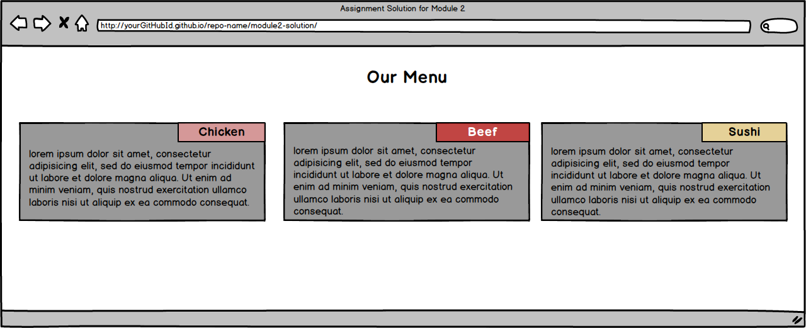

# Module 2 Coding Assignment

Coursera course: [HTML, CSS, and JavaScript for Web Developers](https://www.coursera.org/learn/html-css-javascript-for-web-developers)

Time's here.

**Time to complete:** 1-2 hours.

**Ask questions in Discussions if you get stuck.**

**Don't be put off by the number of steps. Trying for sufficient explaining.**

Here is what is required:

## Set Up Environment

1. Create a GitHub account and a repository to use for this class

2. Follow the [Development Setup video Part 1](https://www.coursera.org/learn/html-css-javascript-for-web-developers/lecture/CoBFV/development-environment-setup-part-1) & [Part 2](https://www.coursera.org/learn/html-css-javascript-for-web-developers/lecture/07KrX/development-environment-setup-part-2-windows) 
	1. Set it up so that you can host and view your finished web pages on GitHub.
	2. You will need to supply that url for peer review.
	* [https://github.com/abjowi/mod2-assignment](https://github.com/abjowi/mod2-assignment)

3. Create a folder in your repository that will serve as a container folder for you solution to this assignment. Suggested names: `module2-solution` or `mod2-solution`. Create an index file inside the solution container:
	* [https://github.com/abjowi/mod2-assignment/blob/main/index.html](https://github.com/abjowi/mod2-assignment/blob/main/index.html)

4. The implementations of the page should follow the mockup illustrations shown below. You are provided 3 mockups:
	* desktop
	* tablet
	* mobile
The implementation will be just __ONE__ webpage, not three. It will be a single, responsive page.

5. The page must include a CSS stylesheet as a separate file. No inline styles allowed. the CSS file should be placed in a folder named css under the solution container, i.e., `mod2-assignment/css`

6. Thou shalt not use any CSS or JavaScript framework in this assignment, nor even speak their name in `index.html` , that thy days may be long and prosperous. 
	- **You may use the simple responsive framework we developed in Lecture 24 as a starting point.**
7. You mus implement the following breakpoints that will be considered desktop, tablet, and mobile:
	1. Desktop version: 992px and greater
	2. Tablet view: min = 768px and max = 991px
	3. Mobile view: max = 767px and less

8. The site is simple. It contains:
	1. Page heading
	2. Three sections of text such as *lorem ipsum*
	
	The layout of the page depends upon the width of the browser window. 

	*Hint: use media queries discussed in Lecture 23*

9. Layout: Desktop view: ≧ 992px
	
		1. Each of the three sections should take up equal amounts of space on the screen.
		As the browser window becomes wider or narrower, each section should become wider or narrower.

		_Hint: use percentages to define `width` and the `float` property, as in Lecture 24_
		
		See image for reference:
		

10. Layout: Tablet view: ≧ 768px &mdash; ≦ 991px
	
		1. 1st and 2nd sections are in the first row and of equal size

		2. 3rd section is in the second row and takes up the entire row by itself

		See image for reference:
		

11. Layout: Mobile view: ≦ 767px
		
		1. Each section takes up an entire row

		See image for reference:
		

12. Section title region:
		1. Eah section has a section title region which is always positioned at the top right corner of the section in each view. 

		2. Copy the titles from the mockup &mdash; Chicken, Beef, Sushi &mdash; or invent own.

		_Hint: use relative and absolute positioning and offsets as in Lecture 22_

13. Spacing:
		1. Pay attention to the spacing in the mockup illustrations.
			1. Note the spacing betyween sections
				1. Horizontal spacing between the edges of the section and the edges of the browser window
				2. Vertical spacing between dummy text and edges of each section
					1. Make sure dummy text is pushed down enough so that it doesn't overlap the section title region.
					_Hint: use `margin` and `padding`, and use `border-box` as `box-sizing` as in Lecture 19_

14. Border and Colors:
		1. Each section should have a `background-color`

		2. Set the `background-color` of each section title region to a unique color
			1. Be sure that the color allows the text in the section and section title to be read
			_Option: Change the color of the text for legibility_

		3. Set a black `border` on bothe section and section title regions that is 1px in `width`

		**Warning: While not specifying borders and colors according to the requirements does not hurt your grade so much, not doing so will make it much harder for your classmates to peer grade the rest of your assignment, possibly resulting in a much lower grade.**

15. _Option: 
		1.Explicitly set a `font-family` for the text in the page as an alternative to the browser default
		2. Set `font-size`:
			1. heading = 75% larger than body
			2. section title = 25% larger than body